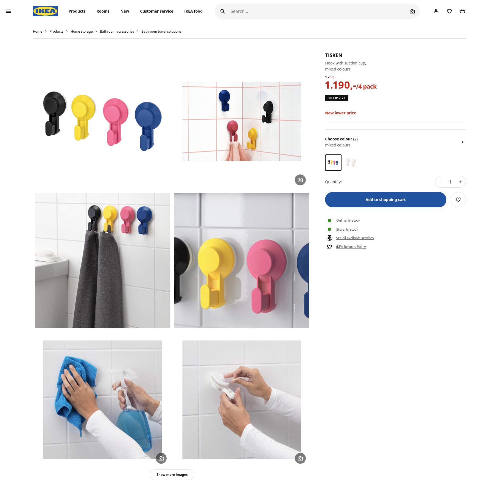
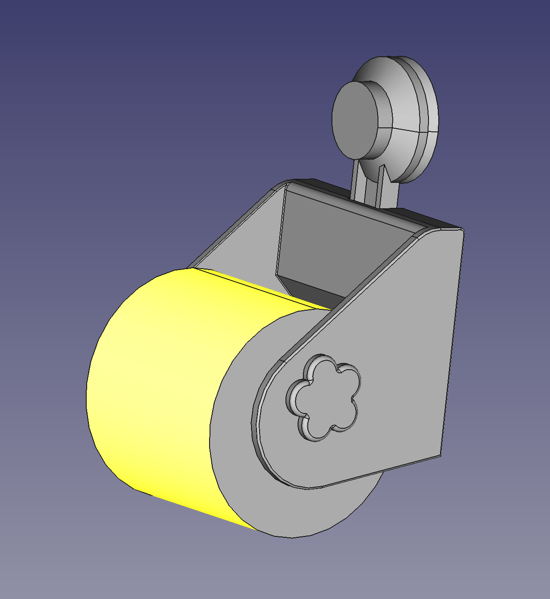
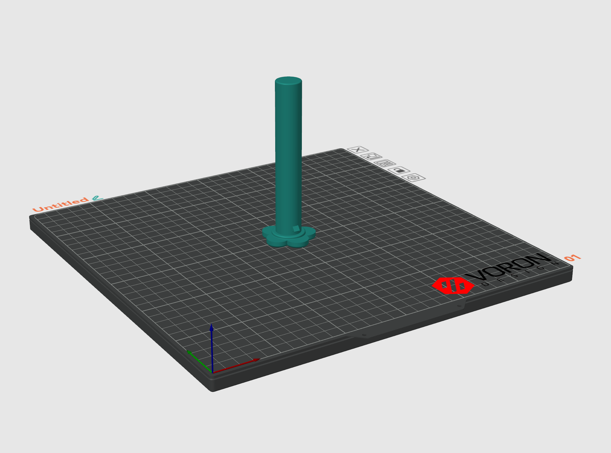
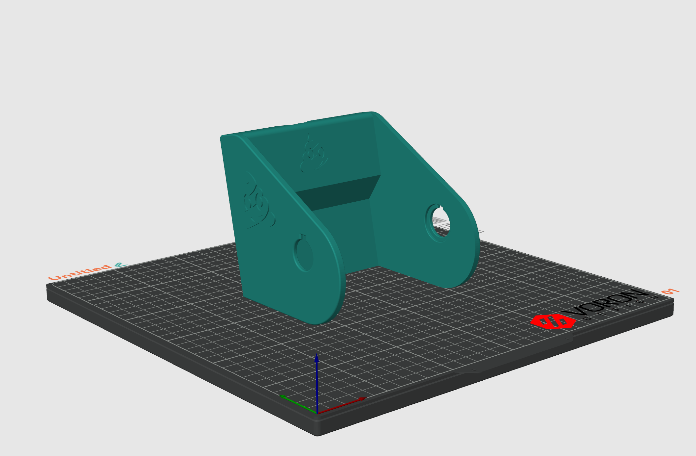

# Toilet paper holder

This is adesign for a 3D printed toilet paper holder that can attach to the Tisken suction cup from IKEA.

You replace the little hook that is attached by default from IKEA with this thing.

The design has two printed parts and the slicer project contains a little embossing with a poop emoji.

